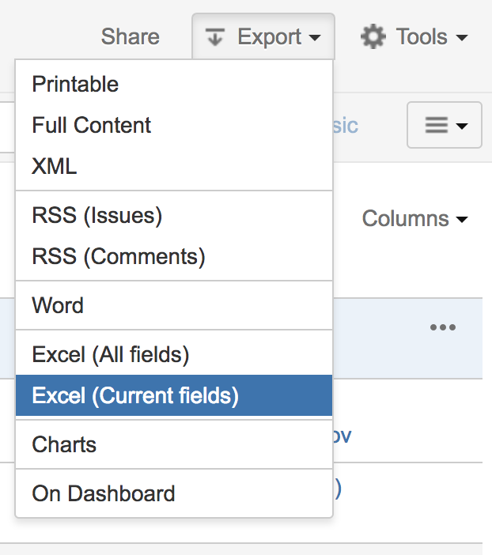

# JIRA User Relations Chart

This repo contains a visualization generator of user relations built using issues data from [Atlassian JIRA](https://www.atlassian.com/software/jira).

An example of such visualization based on anonymized data based on [Victor Hugo's](https://en.wikipedia.org/wiki/Victor_Hugo) characters:


## How to prepare issues data

Step #1: Go to the issues search


Step #2: Find matching issues

Step #3: Export issues result into **Excel format**



## How to run

```
$ jupyter notebook Processor.ipynb
```